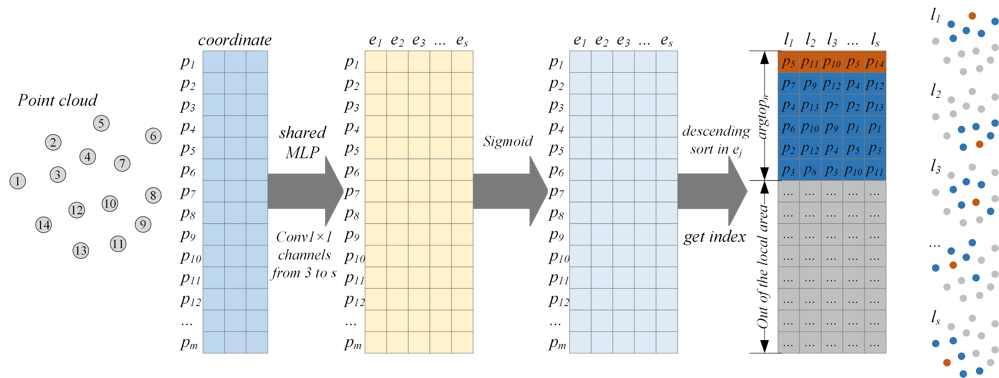

# PSNet: Fast Data Structuring for Hierarchical Deep Learning on Point Cloud
### Luyang Li; Ligang He; Jinjin Gao; Xie Han

This repository is the implementation for our paper :<br>
*[PSNet: Fast Data Structuring for Hierarchical Deep Learning on Point Cloud](https://ieeexplore.ieee.org/document/9766172)*<br>
Published in: *IEEE Transactions on Circuits and Systems for Video Technology*

## Introduction
<br>
**Point Structuring Net** is a differentiable fast grouping and sampling method for deep learning on point cloud, which can be applied to mainstream point cloud deep learning models. Point Structuring Net perform grouping and sampling tasks at the same time. It does not use the relationship between points as a grouping reference, so that the inference speed is independent of the number of points, and friendly to parallel implementation, that reduces the time consumption of sampling and grouping effectively.<br>
Point Structuring Net has been tested on PointNet++ [[1](#Reference)], PointConv [[2](#Reference)], RS-CNN [[3](#Reference)], GAC [[4](#Reference)]. There is not obvious adverse effects on these deep learning models of classification, part segmentation, and scene segmentation tasks and the speed of training and inference has been significantly improved.

# Usage
The [**CORE FILE**](./models/PSN.py) of Point Structuring Net: [models/PSN.py](./models/PSN.py)

## Software Dependencies
Python 3.7 or newer<br>
PyTorch 1.5 or newer<br>
NVIDIA® CUDA® Toolkit 9.2 or newer<br>
NVIDIA® CUDA® Deep Neural Network library (cuDNN) 7.2 or newer<br>
<br>
You can build the software dependencies through **conda**  easily
```shell
conda install pytorch cudatoolkit cudnn -c pytorch
```

## Import Point Structuring Net PyTorch Module
You may import PSNet pytorch module by:
```python
import PSN as psn
```
## Native PSNet
### Defining
```python
psn_layer = psn.PSN(num_to_sample = 512, max_local_num = 32, mlp = [32, 256])
```
Attribute *mlp* is the middle channels of PSN, because the channel of first layer and last layer must be 3 and sampling number.
### Forward Propagation
```python
sampled_points, grouped_points, sampled_feature, grouped_feature = psn_layer(coordinate = {coordinates of point cloud}, feature = {feature of point cloud})
```
*sampled_points* is the sampled points, *grouped_points* is the grouped points.<br>
*sampled_feature* is the sampled feature, *grouped_feature* is the grouped feature.<br>
*{coordinates of point cloud}* is a torch.Tensor object, its shape is [*batch size*, *number of points*, *3*]<br>
*{feature of point cloud}* is a torch.Tensor object, , its shape is [*batch size*, *number of points*, *D*].

## PSNet with Multi-Scale Grouping
### Defining
```python
psn_msg_layer = psn.PSNMSG(num_to_sample = 512, msg_n = [32, 64], mlp = [32, 256])
```
Attribute *msg_n* is the list of multi-scale *n*.
### Forward Propagation
```python
sampled_points, grouped_points_msg, sampled_feature, grouped_feature_msg = psn_msg_layer(coordinate = {coordinates of point cloud}, feature = {feature of point cloud})
```
*sampled_points* is the sampled points, *grouped_points_msg* is the list of mutil-scale grouped points.<br>
*sampled_feature* is the sampled feature, *grouped_feature_msg* is the list of mutil-scale the grouped feature.


# Visualize Effect
### Sampling

### Grouping


# The Experiment on Deep Learning Networks
There is an experiment on PointNet++
## Environments
This experiment has been tested on follow environments:
### Software
Canonical Ubuntu 20.04.1 LTS / Microsoft Windows 10 Pro<br>
Python 3.8.5<br>
PyTorch 1.7.0<br>
NVIDIA® CUDA® Toolkit 10.2.89<br>
NVIDIA® CUDA® Deep Neural Network library (cuDNN) 7.6.5<br>

### Hardware
Intel® Core™ i9-9900K Processor (16M Cache, up to 5.00 GHz)<br>
64GB DDR4 RAM<br>
NVIDIA® TITAN RTX™

## Classification
### Data Preparation
Download alignment **ModelNet** [here](https://shapenet.cs.stanford.edu/media/modelnet40_normal_resampled.zip) and save in `data/modelnet40_normal_resampled/`.

### Run
```shell
python train_cls.py --log_dir [your log dir]
```

## Part Segmentation
### Data Preparation
Download alignment **ShapeNet** [here](https://shapenet.cs.stanford.edu/media/shapenetcore_partanno_segmentation_benchmark_v0_normal.zip)  and save in `data/shapenetcore_partanno_segmentation_benchmark_v0_normal/`.
### Run
```shell
python train_partseg.py --normal --log_dir [your log dir]
```

## Semantic Segmentation
### Data Preparation
Download 3D indoor parsing dataset (**S3DIS**) [here](http://buildingparser.stanford.edu/dataset.html)  and save in `data/Stanford3dDataset_v1.2_Aligned_Version/`.
```shell
cd data_utils
python collect_indoor3d_data.py
```
Processed data will save in `data/stanford_indoor3d/`.
### Run
```shell
python train_semseg.py --log_dir [your log dir]
python test_semseg.py --log_dir [your log dir] --test_area 5 --visual
```

## Experiment Reference
This implementation of experiment is heavily reference to [yanx27/Pointnet_Pointnet2_pytorch](https://github.com/yanx27/Pointnet_Pointnet2_pytorch)<br>
Thanks very much !

# Cite This
```
@ARTICLE{li-psnet-tcsvt,
  author={Li, Luyang and He, Ligang and Gao, Jinjin and Han, Xie},
  journal={IEEE Transactions on Circuits and Systems for Video Technology}, 
  title={PSNet: Fast Data Structuring for Hierarchical Deep Learning on Point Cloud}, 
  year={2022},
  volume={32},
  number={10},
  pages={6835-6849},
  doi={10.1109/TCSVT.2022.3171968}}
```

# Reference
[1] Qi, Charles Ruizhongtai, et al. “[PointNet++: Deep Hierarchical Feature Learning on Point Sets in a Metric Space](http://papers.nips.cc/paper/7095-pointnet-deep-hierarchical-feature-learning-on-point-se).” *Advances in Neural Information Processing Systems*, 2017, pp. 5099–5108. [[PDF](http://papers.nips.cc/paper/7095-pointnet-deep-hierarchical-feature-learning-on-point-sets-in-a-metric-space.pdf)]<br>
[2] Wu, Wenxuan, et al. “[PointConv: Deep Convolutional Networks on 3D Point Clouds](http://openaccess.thecvf.com/content_CVPR_2019/html/Wu_PointConv_Deep_Convolutional_Networks_on_3D_Point_Clouds_CVPR_2019_paper.html).” *2019 IEEE/CVF Conference on Computer Vision and Pattern Recognition (CVPR)*, 2019, pp. 9621–9630. [[PDF](https://openaccess.thecvf.com/content_CVPR_2019/papers/Wu_PointConv_Deep_Convolutional_Networks_on_3D_Point_Clouds_CVPR_2019_paper.pdf)]<br>
[3] Liu, Yongcheng, et al. “[Relation-Shape Convolutional Neural Network for Point Cloud Analysis](http://openaccess.thecvf.com/content_CVPR_2019/html/Liu_Relation-Shape_Convolutional_Neural_Network_for_Point_Cloud_Analysis_CVPR_2019_paper.html).” *2019 IEEE/CVF Conference on Computer Vision and Pattern Recognition (CVPR)*, 2019, pp. 8895–8904. [[PDF](https://openaccess.thecvf.com/content_CVPR_2019/papers/Liu_Relation-Shape_Convolutional_Neural_Network_for_Point_Cloud_Analysis_CVPR_2019_paper.pdf)]<br>
[4] Wang, Lei, et al. “[Graph Attention Convolution for Point Cloud Semantic Segmentation](https://openaccess.thecvf.com/content_CVPR_2019/html/Wang_Graph_Attention_Convolution_for_Point_Cloud_Semantic_Segmentation_CVPR_2019_paper.html).” *2019 IEEE/CVF Conference on Computer Vision and Pattern Recognition (CVPR)*, 2019, pp. 10296–10305. [[PDF](https://openaccess.thecvf.com/content_CVPR_2019/papers/Wang_Graph_Attention_Convolution_for_Point_Cloud_Semantic_Segmentation_CVPR_2019_paper.pdf)]
